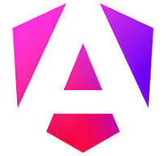
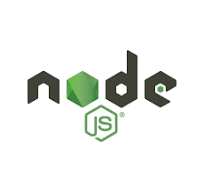
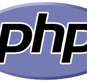

# Hi there, I'm Giddymaster! 👋

## About Me
I'm a **math graduate** with **intermediary IT skills** and a passion for technology, finance, and business. I specialize in:

*Frontend* and *Backend* libraries and frameworks such as react, angular, python, php, javascript, typescript, HTMl&CSS etc.  

  
  
  
  
  
  
  
  

These skills help me in:
- **Web Development** - I do fully customized wesite. 
- **Data Analysis & Predictive Modeling** using python, tableau and matlab.
- **Blockchain Development** - Creation of Bitcoin, Etherium and Solana Smart Contracts  
- **E-commerce** creating ecommerce website for businesses
- **Fintech & Microfinance Solutions** creating banking application for banking sector

## 📈 GitHub Stats
  

Currently, I'm participating in the **Teach2Give web development training** at Murang'a University of Technology, enhancing my skills in front-end and back-end development.  
So far we have trained on these skills:
1. Git and Github
1. HTML
1. CSS
1. Other topics on the course outline include:  
-Javascript  
-Typescript  
-React  
-Nodejs  
-Expressjs  
-PostgreSQL and MongoDB  
-ORM(Prisma)  
among other discipline.

🔗 **Repositories**  
1. [giddymaster](https://github.com/Giddymaster/giddymaster).  
The read.md file of this repository is an assignment to showcase the level of my mastery of writing markdown files. 
1. [Git and Github](https://github.com/Giddymaster/Everyday-Git)  
Go to readme.md file to read more about git. The notes will teach you more about git and how to use git commands on cmd/terminal.  
1. [Dream-vaction destination](https://github.com/Giddymaster/dream-vacation-destinations)  
This is art of the assignment which was all about creating a website using HTML only.
1. Other Repositories include: 
- Daraja-Mpesa-Api - Get more of mpesa push paynment system.  

- AlX repositories. There are few of repositories I pushed while training with ALX SE program.

- Other fun repositories I pushed while teaching my self using online resources such as books, youtube, etc...

💡 *Always learning, always building! Am always available to collabrate in making great projects. Happy coding‼️*

## 🌐 Connect with Me

<a href="https://twitter.com/Giddybrown3" target="_blank">

